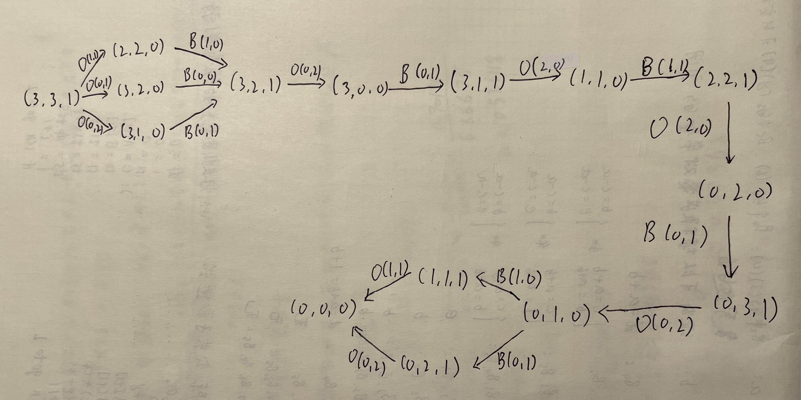

## Homework1
PB19111675  德斯别尔

#### 3.7
##### 给出下列问题的初始状态、目标测试、后继函数和耗散函数。选择精确得足以实现的形式化。

 _a. 只用四种颜色对平面地图染色,要求每两个相邻的地区不能染成相同的颜色。_

* 初始状态：所有地区都未着色
* 目标测试：所有地区均被着色，且相邻地区颜色不同
* 后继函数：为地区指定某一颜色
* 耗散函数：颜色总数
  
_b. 一间屋子里有一只3英尺高的猴子，屋子的房顶上挂着一串香蕉,离地面8英尺。屋子里有两个可叠放起来、可移动、可攀登的3英尺高的箱子。猴子很想得到香蕉。_

* 初始状态：一间屋子里有一只3英尺高的猴子，屋子的房顶上挂着一串香蕉,离地面8英尺。屋子里有两个可叠放起来、可移动、可攀登的3英尺高的箱子。
* 目标测试：猴子得到香蕉
* 后继函数：猴子自身移动；移动箱子；爬上箱子；爬下箱子；堆叠箱子；取下香蕉
* 耗散函数：操作总数
  
_c. 有一个程序，当送入一个特定文件的输入记录时会输出“不合法的输入记录”。已知每个记录的处理独立于其它记录。要求找出哪个记录不合法。_

* 初始状态：检查所有的输入
* 目标测试：检查一条输入，并输出“不合法的输入记录”
* 后继函数：检查前一半输入；检查后一半输入
* 耗散函数：检查总数
  
_d. 有三个水壶，容量分别为12加仑、8加仑和3加仑,还有一个水龙头。可以把壶装满或者倒空，从一个壶倒进另一个壶或者倒在地上。要求量出刚好1加仑水。_

* 初始状态：有三个容量分别为12加仑、8加仑和3加仑的空水壶，记为(0,0,0)
* 目标测试：量出刚好1加仑的水
* 后继函数：接满水壶；倒空水壶；选择水壶；从一个水壶倒入另一个水壶
* 耗散函数：操作总数
  


#### 3.9 
##### 传教士和野人问题通常描述如下：三个传教士和三个野人在河的一边，还有一条能载一个人或者两个人的船。找到一个办法让所有的人都渡到河的另一岸，要求在任何地方野人数都不能多于传教士的人数(可以只有野人没有传教士)。这个问题在AI领域中很著名,因为它是第一篇从分析的观点探讨问题形式化的论文的主题（Amarel, 1968）
_a. 精确地形式化该问题，只描述确保该问题有解所必需的特性。画出该问题的完全状态空间图。_
* 初始状态：一岸有3个传教士、3个野人、一条船，另一岸为空。
* 目标状态：所有人都到达另一岸。
* 后继函数：移动1个或者2个人以及一条船到另一岸去。O(i,j)为送出i个传教士，j个野人；B(i,j)为接回i个传教士，j个野人。
* 耗散函数：1。


_b. 用一个合适的搜索算法实现和最优地求解该问题。检查重复状态是个好主意吗?_

使用BFS可求解该问题
```
BFS(G)
    flag = 0
    for each node u in G
        u.visit = false
    initial_node.visit = true
    EnQueue(init,fron)
    while !isEmpty(front)
        flag = flag + 1
        u = DeQueue(front)
        for each node V in G.f[u] && !v.visit
            if v == goal
                return flag
            v.visit = true
            EnQueue(v,front)
    return -1
```
最优解之一：(3,3,1)->(3,2,0)->(3,2,1)->(3,0,0)->(3,1,1)->(1,1,0)->(2,2,1)->(0,2,0)->(0,3,1)->(0,1,0)->(1,1,1)->(0,0,0)。
该问题的规模不大，不必检查重复状态。

_c. 这个问题的状态空间如此简单，你认为为什么人们求解它却很困难?_

空间规模很大。大部分操作是不被支持的，或者会返回上一状态。
